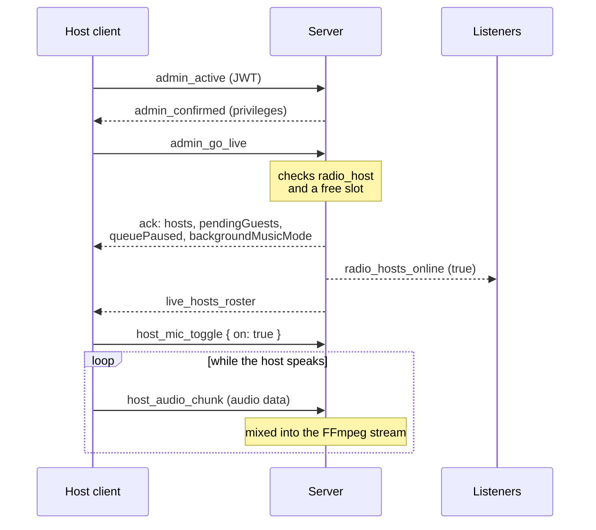
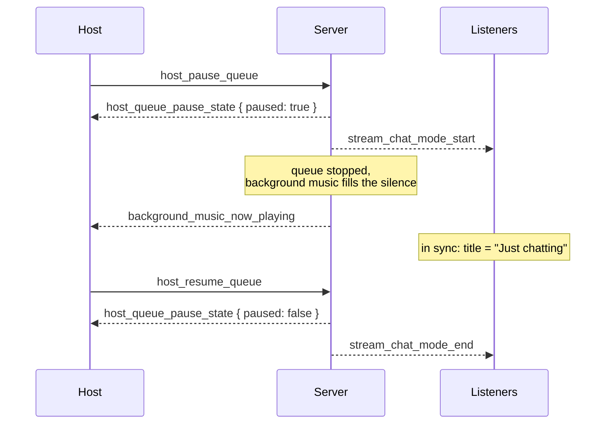
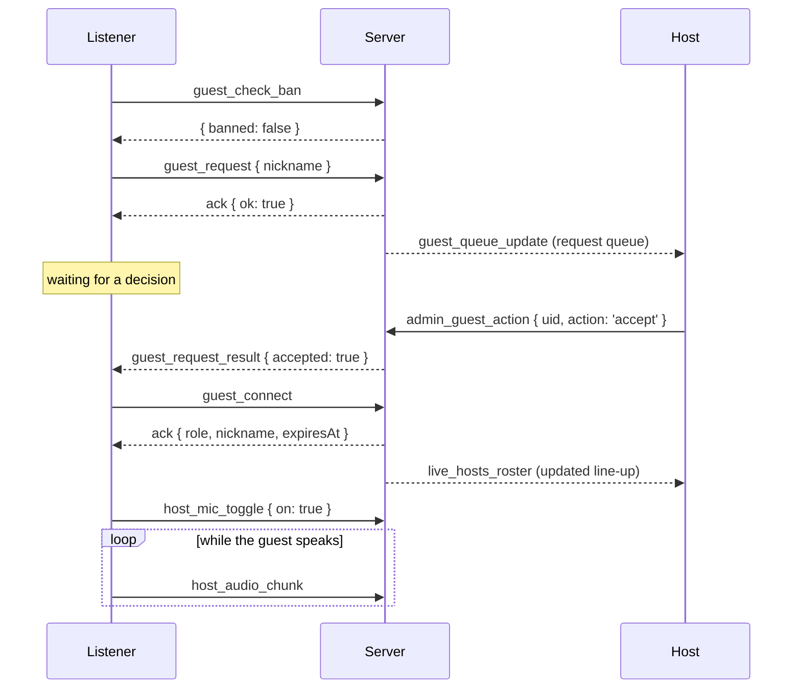
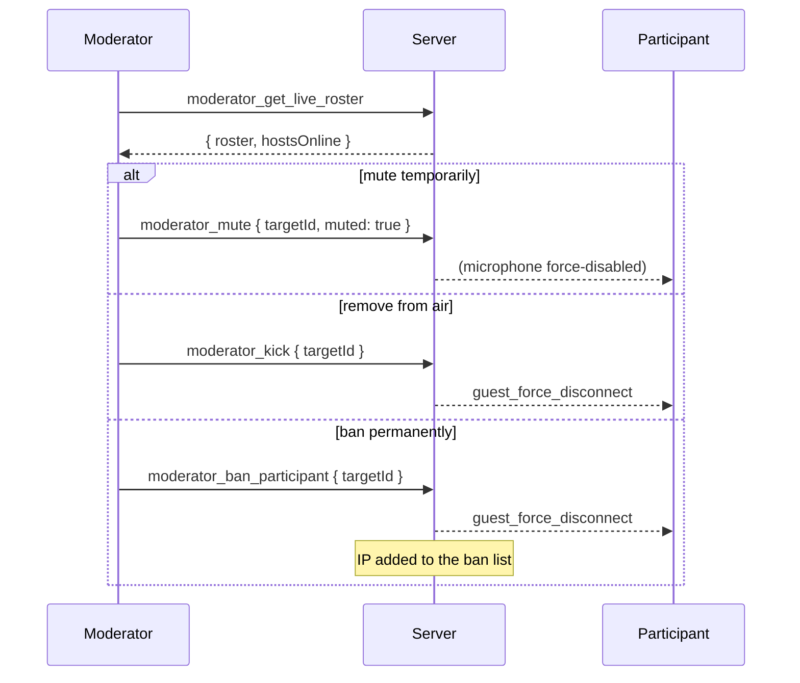
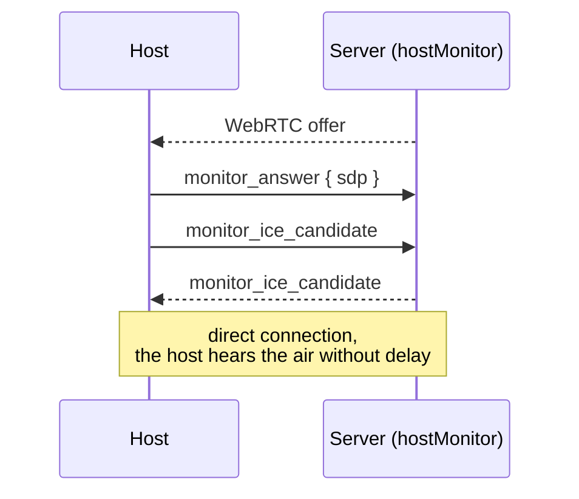

# Live broadcast walkthrough

The most involved part of the protocol. There are over thirty events here, and
the list alone explains little — what matters is the order. This page walks the
four main scenarios end to end.

::: warning Configuration requirements
Everything on this page works **only** when `STREAM_MODE=true` **and**
`RADIO_HOSTS_MODE=true`. Microphones are mixed into the shared FFmpeg stream,
which simply does not exist in sync mode — the server refuses to start with live
hosts enabled but stream mode off.

Check with `GET /api/public/config` → `radioHostsMode`.
:::

## Roles

| Role | Who | How they get on air |
|---|---|---|
| **Host** | admin with the `radio_host` privilege | the `admin_go_live` event |
| **Guest** | an ordinary listener | request → approved by a host |
| **Special guest** | a listener with an access code | a moderator's code, no queue |
| **Moderator** | admin with `radio_moderator` | does not go on air, controls it |

The number of simultaneous participants is capped by `MAX_LIVE_HOST_SLOTS` and
counts hosts and guests **together**.

::: warning One account, one host
Exactly one session survives per account: a second connection disconnects the
first. So putting two people on air needs **two separate accounts** — the super
admin plus a helper holding `radio_host`, or two helpers.

The provider has nothing to do with it: accounts, privileges and the ban list
are stored by both `json` and `sql`. Guests fill the remaining slots either way.
:::

## Scenario 1. A host goes on air



The key point: `admin_go_live` is **not** the first step. The socket must become
an admin socket through `admin_active` first, or the event is silently ignored.
This is the same trap described in the
[admin client guide](/en/guide/admin-client).

Audio chunks are only accepted while the microphone is enabled through
`host_mic_toggle` — otherwise the server drops them without a word.

### Client-side audio processing

The protocol does not pin down the `host_audio_chunk` format rigidly — the
server only needs the chunks to add up to a continuous WebM/Opus stream its
`ffmpeg` decoder can read from `pipe:0`. What follows is how the existing web
client implements this (identically for hosts and guests, scenario 3), so
that whoever builds their own client can match its quality, not just its
format.

**1. Capturing the microphone.**

```js
navigator.mediaDevices.getUserMedia({
  audio: { echoCancellation: true, autoGainControl: true, noiseSuppression: true, channelCount: 1 },
});
```

The track is disabled right away (`track.enabled = false`) — access is
requested up front, alongside rendering the "enable microphone" button, and
the microphone itself only turns on together with `host_mic_toggle`.

**2. Filtering wind and noise before encoding.** The raw stream runs through
a Web Audio graph before it reaches `MediaRecorder`:

```
MediaStreamSource → BiquadFilter(highpass, 100 Hz) → DynamicsCompressor → MediaStreamDestination
```

The high-pass cuts low-frequency wind rumble and handling noise, and the
compressor (`threshold -24dB, ratio 6, attack 3ms, release 150ms`) tames
sharp gusts before they reach Opus. Doing this here matters: the server
boosts the microphone by 2–7× (`host_mic_gain`), and any spike left
unchecked in the raw signal gets amplified along with the voice and becomes
audibly distorted. If `AudioContext` is unavailable (an old browser), the
client falls back to the raw stream with no filtering — the server accepts
the data either way.

**3. Encoding and transport.**

```js
new MediaRecorder(processedStream, {
  mimeType: 'audio/webm;codecs=opus',
  audioBitsPerSecond: 64000,
});
recorder.start(250); // timeslice, ms
recorder.ondataavailable = (e) =>
  e.data.arrayBuffer().then((buf) => socket.emit('host_audio_chunk', buf));
```

Each timeslice `Blob` is converted to an `ArrayBuffer` and sent as its own
event. These are not self-contained WebM files but pieces of one ongoing
stream — the server keeps one long-lived `ffmpeg` process per participant, so
delivery order must be preserved (Socket.IO guarantees that within a single
connection).

::: info The server filters again too
Incoming PCM also passes through the server's own `highpass` (90 Hz) before
mixing into the shared stream — a custom client can rely on this as a second
line of defense rather than doing all the filtering itself.
:::

**4. Own-level indicator.** Separately from what goes on air, the client
creates an `AnalyserNode` on the *raw* (unfiltered) stream and reads RMS
every ~120 ms — purely for the "your mic is picking up sound" UI indicator,
it has no effect on the broadcast itself.

## Scenario 2. Pausing the queue and background music



A listener client learns about this two ways: instantly through
`stream_chat_mode_start`, and within two seconds through `sync`, where `title`
becomes `"Just chatting"` and `artist` goes empty. Handling either is enough,
but track metadata has to be replaced with something or the interface will look
broken.

If `backgroundMusicMode` is `hostChoice`, the host picks a track by hand:

```js
socket.emit('host_get_background_music_list', { offset: 0, limit: 5 }, ({ items }) => {…});
socket.emit('host_set_background_music', { trackId }, ({ ok }) => {…});
```

## Scenario 3. A guest joins the broadcast

The longest path: four parties and two waiting points.



Two non-obvious things:

**Approval does not put the guest on air.** After `guest_request_result` with
`accepted: true` the client must send `guest_connect` — a separate step. Without
it the guest stays off air.

**The slot can vanish between request and decision.** If it was taken while the
request waited, the guest is refused with `reason: 'room_full'` and the host
gets an error.

Guests are time-limited: `expiresAt` in the confirmation is when the session
will be cut off. The duration lives in the radio settings and changing it
requires the `radio_moderator` privilege.

### Special guests skip the queue

```js
socket.emit('special_guest_connect', { code, nickname }, (res) => {…});
```

The code is issued by a moderator. Attempts are rate-limited, and an expired or
deactivated code returns an error.

## Scenario 4. Moderation



A moderator can do more than a host:

| Action | Host | Moderator |
|---|---|---|
| Mute a guest | `host_guest_mute` | `moderator_mute` |
| Mute a **host** | no | yes |
| Remove a guest | `host_guest_kick` | `moderator_kick` |
| Ban by IP | no | yes |
| Issue a special-guest code | yes | yes |

Hosts cannot be banned at all — bans apply to guests only.

::: info The ban list works on either provider
`moderator_get_banlist`, `moderator_ban_participant`, `moderator_ban_ip` and
`moderator_unban_ip` are available with both `json` and `sql`. They switch off
only when storage does not survive a restart —
[Ephemeral hosting](/en/guide/full-configuration#ephemeral-hosting).
:::

## Personal monitoring

The shared MP3 stream reaches listeners a few seconds late — unacceptable for a
host, who would hear themselves echoed. Hence a separate low-latency WebRTC
channel.



In production this needs UDP ports in the
`HOST_MONITOR_ICE_PORT_MIN`–`HOST_MONITOR_ICE_PORT_MAX` range (40000–40099 by
default) to be open, and a reachable STUN server in `HOST_MONITOR_STUN_URL`.

## Leaving the air

```js
socket.emit('admin_leave_live');   // host
socket.emit('guest_leave_live');   // guest
```

Disconnecting has the same effect: the slot is freed, the line-up is broadcast
again, and listeners receive `radio_hosts_online`.

If the session is ended externally — by removal, a ban, or the `expiresAt`
limit — `host_force_disconnect` or `guest_force_disconnect` arrives. The client
must stop capturing the microphone and tear down the broadcast UI: the server
will no longer accept audio chunks, but it will not remind you either.
