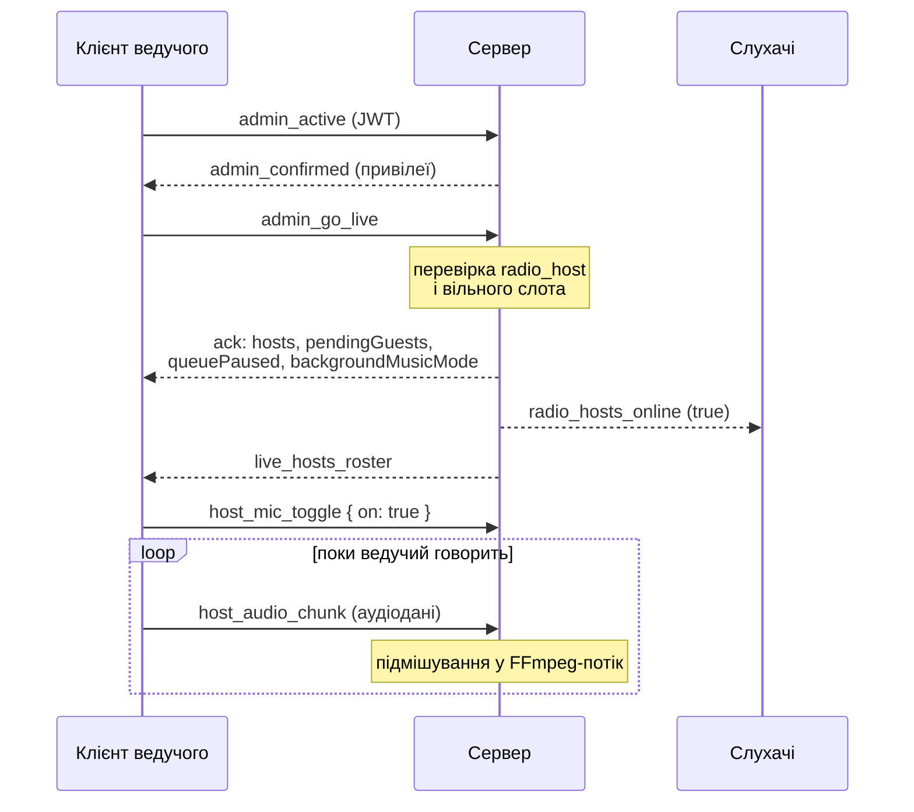
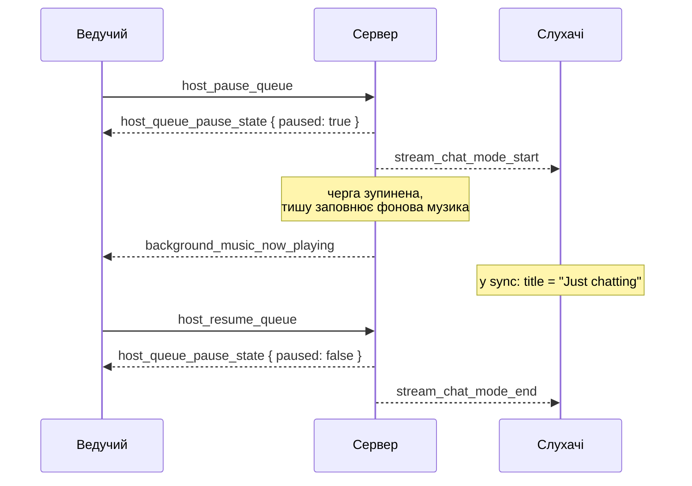
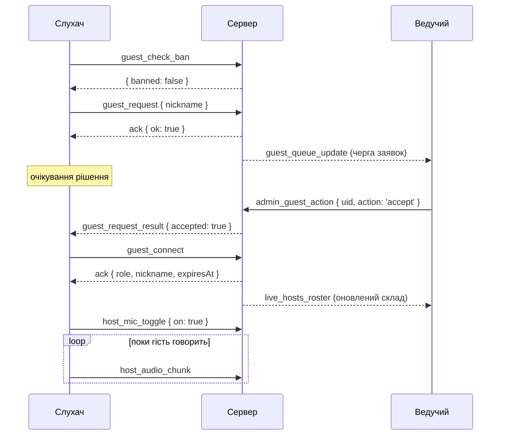
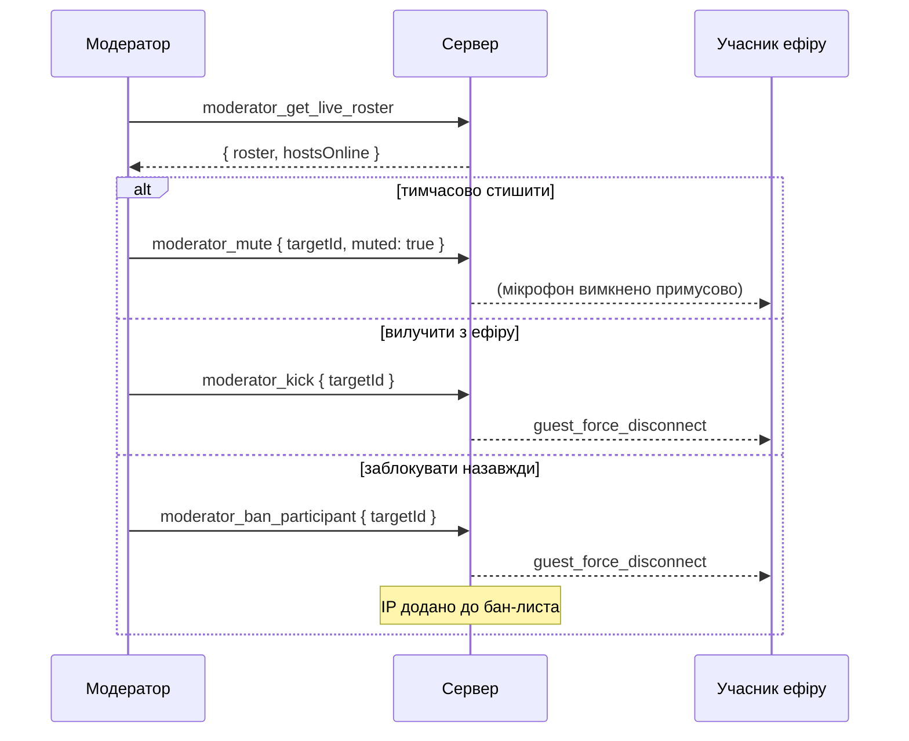
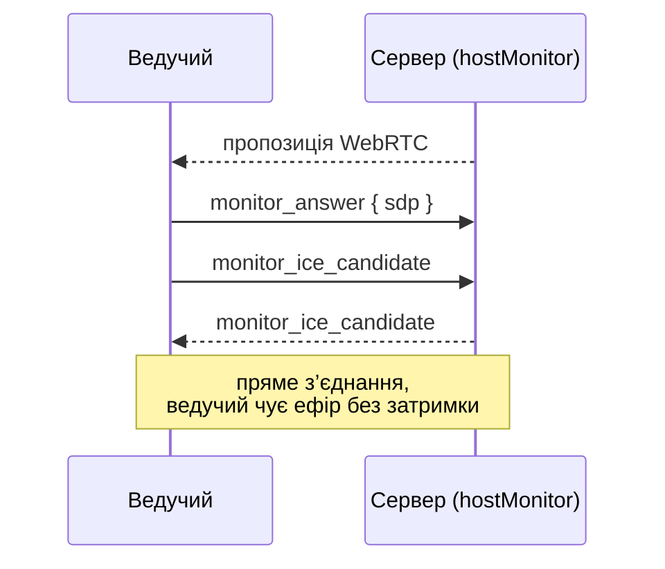

# Живий ефір: послідовності

Найскладніша частина протоколу. Подій тут понад тридцять, і сам їх перелік мало
що пояснює — значення має порядок. Ця сторінка показує чотири основні сценарії
цілком.

::: warning Вимоги до конфігурації
Усе на цій сторінці працює **лише** коли `STREAM_MODE=true` **і**
`RADIO_HOSTS_MODE=true`. Мікрофон підмішується у спільний FFmpeg-потік, якого в
sync-режимі просто не існує — сервер відмовляється стартувати з увімкненими
ведучими без stream-режиму.

Перевірити можна з `GET /api/public/config` → `radioHostsMode`.
:::

## Ролі

| Роль | Хто це | Як потрапляє в ефір |
|---|---|---|
| **Ведучий** | адмін із привілеєм `radio_host` | подія `admin_go_live` |
| **Гість** | звичайний слухач | заявка → схвалення ведучим |
| **Спецгість** | слухач із кодом доступу | код від модератора, без черги |
| **Модератор** | адмін із `radio_moderator` | не виходить в ефір, керує ним |

Кількість одночасних учасників обмежена `MAX_LIVE_HOST_SLOTS` і рахує **разом**
ведучих і гостей.

::: warning Один обліковий запис — один ведучий
На обліковий запис живе рівно одна сесія: друге підключення відключає перше.
Тож щоб в ефірі було двоє людей, потрібні **два різні облікові записи** —
супер-адмін і помічник із привілеєм `radio_host`, або два помічники.

Провайдер тут ні до чого: облікові записи, привілеї та бан-лист зберігають
обидва — і `json`, і `sql`. Гості займають решту слотів незалежно від цього.
:::

## Сценарій 1. Ведучий виходить в ефір



Ключове: `admin_go_live` **не** перший крок. Сокет спершу має стати адмінським
через `admin_active`, інакше подія буде мовчки проігнорована. Це та сама пастка,
що описана в [адмінському гайді](/guide/admin-client).

Аудіо-фрагменти приймаються лише поки мікрофон увімкнено через
`host_mic_toggle` — інакше сервер їх відкидає без повідомлення.

### Обробка звуку на клієнті

Протокол не фіксує формат `host_audio_chunk` жорстко — сервер очікує лише, щоб
надіслані фрагменти складались у безперервний WebM/Opus-потік, який його
`ffmpeg`-декодер зможе прочитати з `pipe:0`. Нижче — як це реалізовано в
наявному веб-клієнті (однаково для ведучого й гостя, сценарій 3), щоб автор
власного клієнта міг відтворити порівнянну якість, а не лише формат.

**1. Захоплення мікрофона.**

```js
navigator.mediaDevices.getUserMedia({
  audio: { echoCancellation: true, autoGainControl: true, noiseSuppression: true, channelCount: 1 },
});
```

Трек одразу вимикається (`track.enabled = false`) — доступ запитується
заздалегідь, разом із рендером кнопки "увімкнути мікрофон", а сам мікрофон
вмикається лише разом з `host_mic_toggle`.

**2. Фільтрація вітру й шуму перед кодуванням.** Сирий потік проходить через
Web Audio graph, перш ніж потрапити в `MediaRecorder`:

```
MediaStreamSource → BiquadFilter(highpass, 100 Hz) → DynamicsCompressor → MediaStreamDestination
```

High-pass зрізає низькочастотний гул вітру й поштовхів по мікрофону,
компресор (`threshold -24dB, ratio 6, attack 3ms, release 150ms`) вирівнює
різкі пориви до того, як вони підуть у Opus. Це важливо зробити саме тут:
сервер підсилює мікрофон у 2–7 разів (`host_mic_gain`), і будь-який
непридушений сплеск у сирому сигналі підсилюється разом з голосом і чутно
спотворюється. Якщо `AudioContext` недоступний (старий браузер), клієнт
відкочується на сирий потік без фільтрації — сервер однаково прийме дані.

**3. Кодування й транспорт.**

```js
new MediaRecorder(processedStream, {
  mimeType: 'audio/webm;codecs=opus',
  audioBitsPerSecond: 64000,
});
recorder.start(250); // timeslice, мс
recorder.ondataavailable = (e) =>
  e.data.arrayBuffer().then((buf) => socket.emit('host_audio_chunk', buf));
```

Кожен фрагмент (`Blob`) від таймслайсу конвертується в `ArrayBuffer` і йде
окремою подією. Це не самостійні WebM-файли, а шматки одного тривалого
потоку — сервер тримає по одному довгоживучому процесу `ffmpeg` на учасника,
тож порядок доставки фрагментів має зберігатись (у межах одного з'єднання
Socket.IO це гарантовано).

::: info Сервер підстраховує ще раз
Вхідний PCM додатково проходить через власний `highpass` сервера (90 Hz)
перед мікшуванням у спільний потік — власний клієнт може покладатись на це як
на другий рубіж, а не переносити всю фільтрацію виключно на себе.
:::

**4. Індикація власного рівня.** Окремо від того, що йде в ефір, клієнт
створює `AnalyserNode` на *сирому* (нефільтрованому) потоці й читає RMS кожні
~120 мс — суто для UI-індикатора "мікрофон вас чує", на сам ефір це не
впливає.

## Сценарій 2. Пауза черги й фонова музика



Слухацький клієнт дізнається про це двома шляхами: миттєво через
`stream_chat_mode_start` і в межах двох секунд через `sync`, де `title` стає
`"Just chatting"`, а `artist` порожніє. Достатньо обробляти будь-який із них,
але метадані треку треба чимось замінити — інакше інтерфейс виглядатиме
зламаним.

Якщо `backgroundMusicMode` дорівнює `hostChoice`, ведучий обирає трок вручну:

```js
socket.emit('host_get_background_music_list', { offset: 0, limit: 5 }, ({ items }) => {…});
socket.emit('host_set_background_music', { trackId }, ({ ok }) => {…});
```

## Сценарій 3. Гість приєднується до ефіру

Найдовший шлях: чотири сторони й дві точки очікування.



Дві неочевидні речі:

**Схвалення не вводить гостя в ефір.** Після `guest_request_result` з
`accepted: true` клієнт зобов'язаний надіслати `guest_connect` — це окремий
крок. Без нього гість лишиться поза ефіром.

**Слот може зникнути між заявкою і рішенням.** Якщо місце зайняли, поки заявка
чекала, гість отримає відмову з `reason: 'room_full'`, а ведучий — помилку.

Гість має обмежений час: `expiresAt` в підтвердженні — це момент примусового
завершення. Тривалість задається в налаштуваннях радіо і потребує привілею
`radio_moderator` для зміни.

### Спецгість без черги

```js
socket.emit('special_guest_connect', { code, nickname }, (res) => {…});
```

Код видає модератор. Кількість спроб обмежена, протухлий або вимкнений код дає
помилку.

## Сценарій 4. Модерація



Права модератора ширші за права ведучого:

| Дія | Ведучий | Модератор |
|---|---|---|
| Стишити гостя | `host_guest_mute` | `moderator_mute` |
| Стишити **ведучого** | ні | так |
| Вилучити гостя | `host_guest_kick` | `moderator_kick` |
| Заблокувати за IP | ні | так |
| Видати код спецгостя | так | так |

Заблокувати ведучого не можна взагалі — бан діє лише на гостей.

::: info Бан-лист працює на будь-якому провайдері
`moderator_get_banlist`, `moderator_ban_participant`, `moderator_ban_ip` і
`moderator_unban_ip` доступні і з `json`, і з `sql`. Вимикаються вони лише тоді,
коли сховище не переживає перезапуск —
[Ефемерний хостинг](/guide/full-configuration#ефемерний-хостинг).
:::

## Персональний моніторинг

Спільний MP3-потік доходить до слухача із запізненням у кілька секунд — для
ведучого це неприйнятно: він чув би себе з відлунням. Тому існує окремий
WebRTC-канал з мінімальною затримкою.



У продакшені для цього треба відкрити UDP-порти в діапазоні
`HOST_MONITOR_ICE_PORT_MIN`–`HOST_MONITOR_ICE_PORT_MAX` (типово 40000–40099) і
вказати доступний STUN-сервер у `HOST_MONITOR_STUN_URL`.

## Завершення ефіру

```js
socket.emit('admin_leave_live');   // ведучий
socket.emit('guest_leave_live');   // гість
```

Розрив з'єднання дає той самий результат: слот звільняється, склад ефіру
розсилається заново, слухачі отримують `radio_hosts_online`.

Якщо сесію завершено ззовні — вилученням, баном або через `expiresAt` — приходить
`host_force_disconnect` або `guest_force_disconnect`. Клієнт має зупинити
захоплення мікрофона і прибрати інтерфейс ефіру: сервер більше не прийме
аудіо-фрагменти, але сам про це не нагадає.
